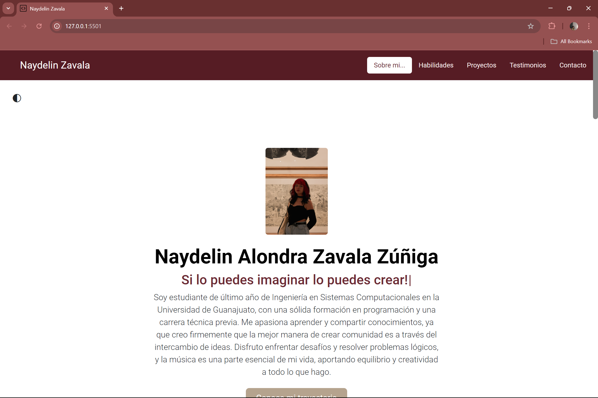
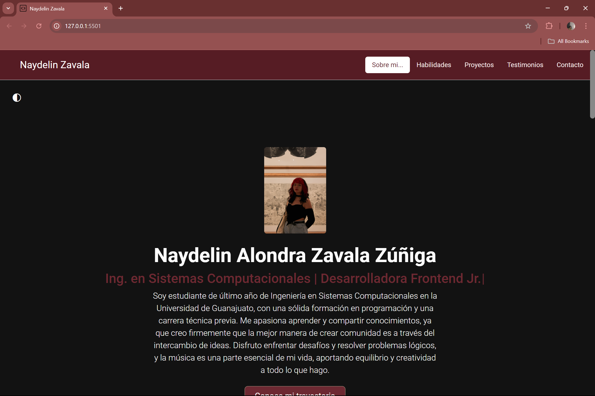
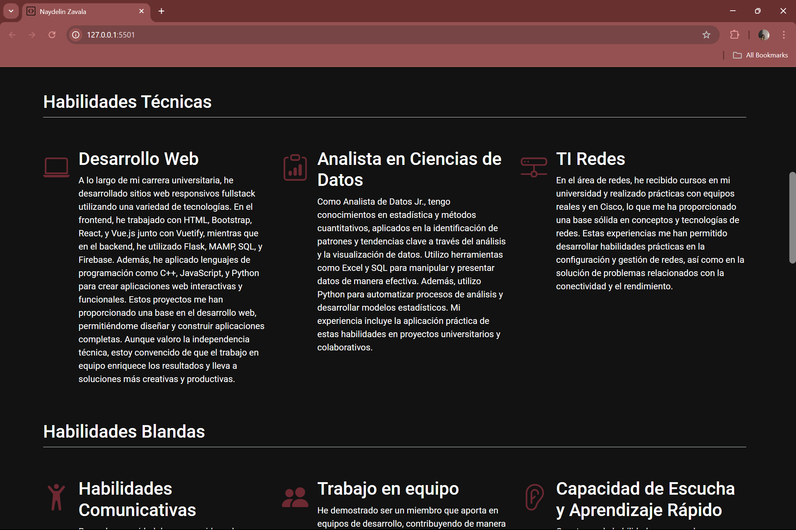
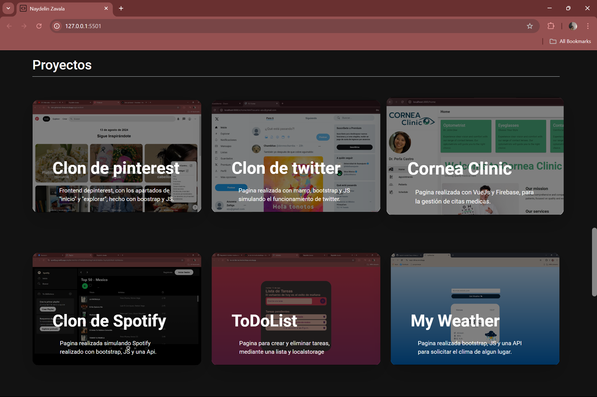
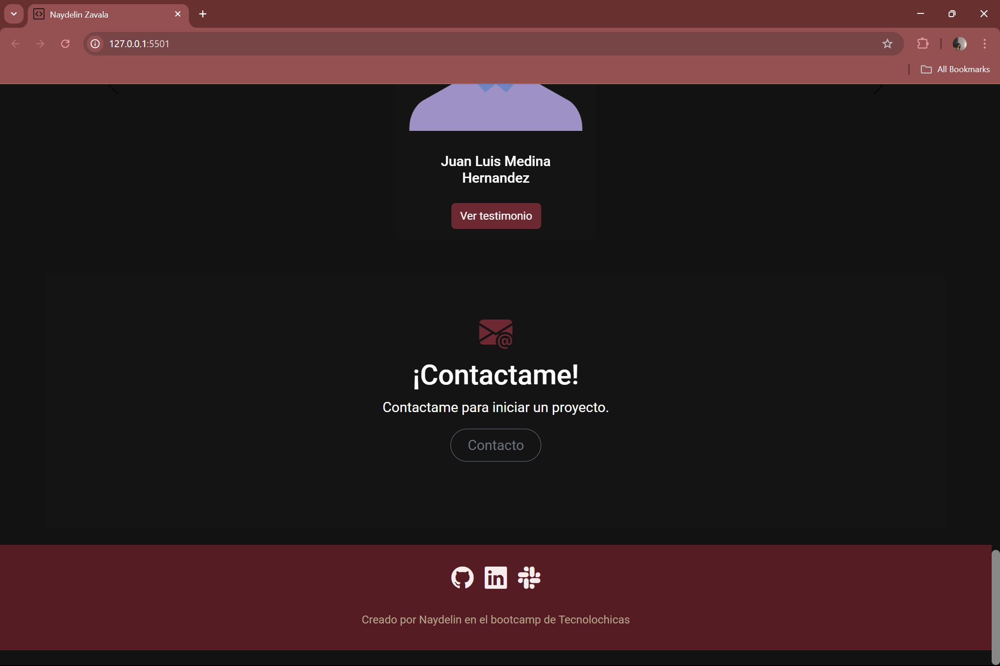

#Portafolio de Naydelin Alondra Zavala Zúñiga
## Proyecto responsivo realizado con Bootstrap 5

Proyecto creado durante el bootcamp de Technolochicas PRO, es adaptable a 
distintos dispositivos o tamaños de pantalla.
El propósito de está página web es mostrar mi portafolio de proyectos como 
desarrolladora web.

Podrás encontrarlo aquí [Portafolio](https://Nayde666.github.io/).

### Tecnologías
* HTML
* CSS
* Bootstrap 5
* JAVASCRIPT

### El proyecto cuenta con las siguientes secciones:
* Sobre mí
* Habilidades
* Proyectos (Cada proyecto cuenta con su propio link para ver la previsualización del proyecto, con dar click en el titulo basta)
* Testimonios
* Contacto
* Visibilidad para un modo "Claro" o "Oscuro"

# Vista Previa:

